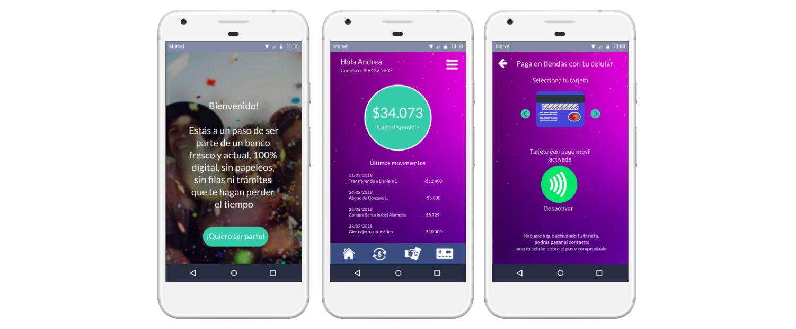

# Easy Bank

Easy Bank es una app móvil perteneciente a un banco nacional de gran trayectoria, que permite a sus usuarios “Millennials” tener una cuenta bancaria 100% digital, sin plástico ni trámites para acceder a ella.

## Desarrollado para [Laboratoria](http://laboratoria.la)

# I. El reto: Nuevo banco digital para millenials

El desafío consistía en que un banco ficticio muy importante y de muchos años, llamado Banco del País, está pasando por un proceso de transformación digital. Como parte de este proceso, han implementado un área de innovación que quiere llegar de una mejor manera a los usuarios más jóvenes. Por lo que, inspirados en Nequi, Nubank y Simple se han propuesto crear un banco 100% digital dirigido para millenials. Es nuestra primera semana en la empresa y nos han pedido que nos encarguemos de esa investigación y crear un prototipo de la nueva banca digital - basado en el journey más crítico que se encuentre en la investigación.

# II. Kick-off

Comenzamos el reto simulando una reunión de Kick Off, analizando quiénes podrían ser nuestros Stakeholders y hacerles las preguntas correspondientes para definir los objetivos de la empresa.

- **Subgerencia Experiencia Cliente**

- ¿En qué aspectos de la competencia (Nequi, Nubank y Simple) se inspiraron y cuáles quieren replicar?
- ¿Cuál sería el enfoque para este segmento de usuario? En la práctica, ¿qué servicios y condiciones harían la diferencia con la banca tradicional?
- ¿En qué datos se basaron para determinar que nuestro target de usuario es el público joven?
- Según sus datos, ¿cuáles son los puntos con más críticos para el cliente en el banco?
- ¿Cuál es la cantidad de usuarios satisfechos e insatisfechos con la atención del servicio actual?

- **Depto. de Tecnología e Informática**

- ¿Su tecnología está óptimamente equipada para incluir una plataforma 100% digital?
- En caso de necesitar recursos, ¿cuáles serían los tiempos estimados para su implementación?
- ¿Cuál es el presupuesto estimado necesario para implementar los equipos y personal que se requiere?

- **Front-end y Back-end**

- ¿En cuánto tiempo estimado podrían realizar un proyecto de esta magnitud?
- ¿Hay maneras de optimizar aún más la plataforma actual o es necesario un cambio radical en esta?

## Business Model Canvas

Realizamos un Business Model Canvas para comprender el negocio y determnar los objetivos de este.

# III. Research

## Encuestas

De acuerdo al reto planteado, la primera etapa de investigación fue un research cuantitativo al público objetivo donde nos hemos enfocado. Realizamos encuestas online mediante Google Forms para entender algunos comportamientos de los usuarios de banco.
 
Dentro de un universo de 33 personas encuestadas, entre hombres y mujeres de 18 a 30 años, los principales resultados son las siguientes: 

sólo un 3% no pertenece a ningún banco, y su motivo principal es el descontento por las instituciones: los cobros y los papeleos.

Además, la gran mayoría lleva 2 años o más, por lo que da a entender que a pesar de que puedan tener problemas o diferencias con su banco, buscan la estabilidad.

A la hora de preguntarles "¿por qué escogiste el banco donde estás actualmente", la respuesta principal está directamente relacionada con una opción más accesible: 

- "El sueldo que piden como requisito para crear una cuenta corriente es muy alto"
- "Mi banco actual fue el único que me aceptó cuando empecé a trabajar y no tenía liquidaciones"
- "Lo escogí por las facilidades para acceder a él"

Ante los reclamos, el principal es el de los cobros excesivos:

- "Que no cobren por todo, o sea, revisar saldo, girar o transferir: todo tiene un costo"
- "No deberían cobrar por giros"
- "La Cuenta Rut, que es lo más accesible, te cobra mucho: por sacar, por hacer transferencia, por todo"

## Entrevistas

Entrevistamos gente de manera presencial, y ésta fue la guía de preguntas:

1. ¿Qué edad tienes?
2. ¿Eres actualmente cliente de un banco?
3. ¿Cuánto tiempo llevas en el banco?
4. ¿Por qué escogiste ese banco?
5. Antes de este, ¿estuviste en otro banco?
6. ¿Qué te llevó a cambiarte a tu banco actual?
7. ¿Alguna vez has tenido algún problema con tu banco?
8. De ser así, ¿el banco te lo ha solucionado? ¿Ha sido burocrático o expedito en la solución?
9. ¿Crees que hay algo que el banco debería mejorar o cambiar en su servicio o productos que ofrece?
10. Cuéntanos cómo administras tu presupuesto mensual en general, cómo llevas las cuentas, los pagos, etc…
11. ¿Con qué frecuencia vas a la sucursal de tu banco? ¿Por qué tipo de trámites vas?
12. ¿Cuando ingresas a la plataforma digital del banco, desde lo haces más: computador o celular?
13. ¿Tienes instalada la app?
14. ¿Qué acciones haces con más frecuencia en la app?
15. ¿Recuerdas alguna mala experiencia con la app/web que hayas tenido? ¿Alguna acción que se te hizo difícil o que no pudiste realizar?
16. Del 1 al 10 ¿Qué tan conforme/disconforme estás con la app/web? ¿Por qué?

Descubrimos que muchos de los encuestados debían pagar por cada vez que transferían a un tercero. Además la plataforma para transferir no era confiable, según sus propias palabras, esta sección se pegaba, se caía o no era clara. 

El pequeño porcentaje que no pertenece a un banco, comparte algunas de las quejas de las personas que sí son clientes, pero estos últimos terminan aceptando las “injusticias” que ejercen los bancos por la necesidad de tener los servicios que ofrecen.
 
Conocimos el caso de Nicolás, de 28 años, que no pertenece actualmente a ningún banco y manifiesta su descontento con estas palabras:

*"No me gusta tener tarjeta, es un mal necesario (…) siempre se me pierden, y es una lata sacarlas de nuevo, además cobran por eso, y cobran mantención. Eso no debería ser.*

*Además es engorroso, porque hay que ir al banco a pedirla, después de nuevo para ir a buscarla. Una vez no fui a buscar una tarjeta, y era como la quinta que se me perdía, por eso dejé de ocupar tarjeta.*

*No me gusta hacer filas tampoco, siempre tenía que hacerlas porque no era cliente preferencial. (…) No me gusta la muchedumbre, ni la gente ni hacer fila. (…) Además con la “Cuenta Rut”, que es lo más accesible, te cobran mucho: por sacar, por hacer transferencia, por todo. Intentan sacarte plata por todos lados y eso no está bien.* 

*Por eso no tengo tarjeta ni por eso estoy en un banco.*

## Diagrama de Afinidad

Se organizó en un mapa de afinidad las inquietudes en común de los usuarios de bancos, cuyas frustraciones principales son cobros por mantención, por transferencia y por giros, trámites engorrosos y requisitos que no podían cumplir para abrir una cuenta, y plataformas digitales complicadas e ineficientes.

## Customer Journey Map

Pero la principal “mala experiencia” ocurría a la hora de solicitar una cuenta: los estrictos requisitos y la gran cantidad de documentación que se pide hacían que muchas personas se frustraran al no calzar con los estándares que pedía el banco, ya sea porque no cumplían con lo que se pedía o por falta de documentación y excesivo papeleo:

# IV. MVP
 
De acuerdo a todas estas inquietudes, nuestro Producto Mínimo Viable debe:
1. Permitir el acceso a cuenta a todos, mayores de 18 años, sin requisitos excluyentes, ni documentos, ni trámites, ya que eso es lo que aleja a la gente y a gran parte los deja fuera por no cumplir con lo que se les pide.
2. Permitir a los clientes realizar transferencias y giros sin cobros de por medio
3. Libre de tarjetas. Nuestro producto es 100% digital
4. Una plataforma amigable, con información clara, que se dirija en un lenguaje sencillo y cercano.

## Testing

## Prototipo

